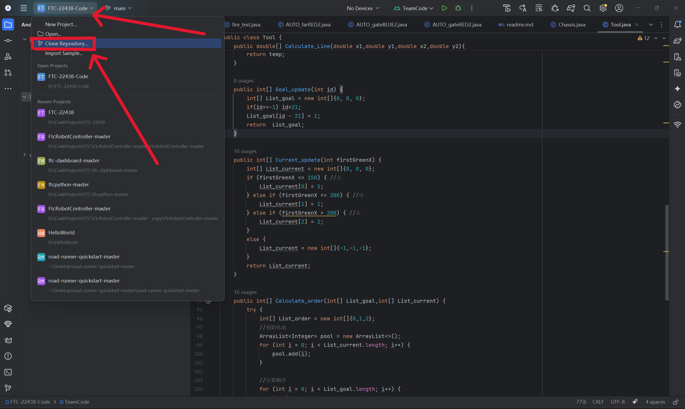
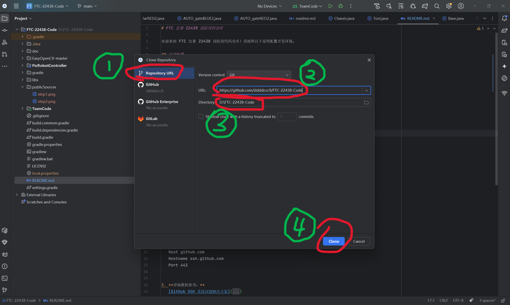
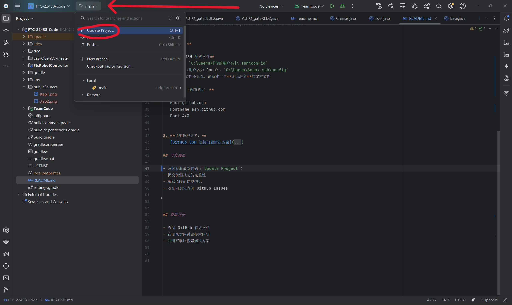
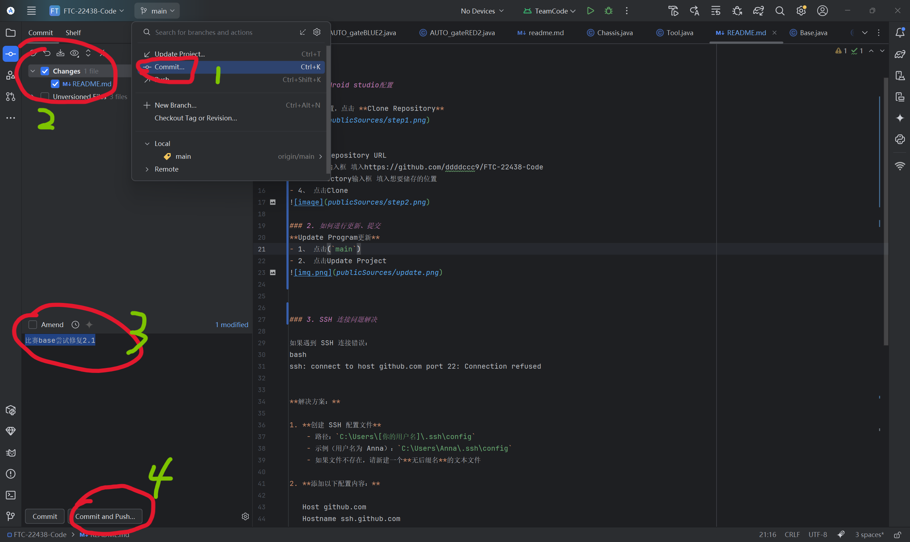

# FTC 比赛 22438 团队代码仓库

欢迎来到 FTC 比赛 22438 团队的代码仓库！请按照以下说明配置开发环境。

## 环境配置

### 1. Android studio配置
**第一步**
-根据图示位置，点击 **Clone Repository** 

**第二步**
- 1、 选择Repository URL
- 2、 URL输入框 填入https://github.com/ddddccc9/FTC-22438-Code
- 3、 Directory输入框 填入想要储存的位置
- 4、 点击Clone

### 2. 如何进行更新、提交
**Update Program更新**
- 1、 点击(`main`)
- 2、 点击Update Project

**Commit & Push更新**
- 1、 点击(`main`)
- 2、 点击Commit
- 3、 勾选需要保存的更改
- 4、 点击Commit and Push即可上传你的更改到云端
  

### 3. SSH 连接问题解决

如果遇到 SSH 连接错误：
bash
ssh: connect to host github.com port 22: Connection refused

**解决方案：**

1. **创建 SSH 配置文件**
    - 路径：`C:\Users\[你的用户名]\.ssh\config`
    - 示例（用户名为 Anna）：`C:\Users\Anna\.ssh\config`
    - 如果文件不存在，请新建一个**无后缀名**的文本文件

2. **添加以下配置内容：**

   Host github.com
   Hostname ssh.github.com
   Port 443

3. **详细教程参考：**  
   [GitHub SSH 连接问题解决方案](https://annachengdesu.github.io/post/problem-solved/github-ssh-connection-refuse/)

## 开发规范

- 及时拉取最新代码（`Update Project`）
- 提交前测试功能完整性
- 编写清晰的提交信息
- 遇到问题先查阅 GitHub Issues
- **每一个代码文件前都要标清楚该文件的功能及描述 具体样式可参考当前已有文件**

## 获取帮助

- 查阅 GitHub 官方文档
- 在团队群内讨论技术问题
- 利用互联网搜索解决方案

